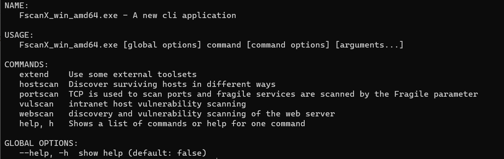

<h1 align="center">
  FsanX 
  <br>
</h1>

<h4 align="center">golang 语言编写的内网综合利用扫描器</h4>

<p align="center">
  <a href="#credits">介绍</a> •
  <a href="#key-features">实现功能</a></a> •
  <a href="#how-to-use">怎样使用</a> •
  <a href="#download">下载</a> •
  
</p>

## 介绍 :

事实上FscanX优秀的来源来自fscan和LodanGo这两个开源项目，首先不得不说fscan和LadonGo两个都是非常好的内网扫描器。而且其独特的特色也让它的扫描仪扫描领域独占鳌头。有LadonGo的插件式让其在扫描时更专注，而则将其内网的信息更完美。选择），所以我将其Fscan进行了完全改造，在结合了LadonGo的单插件扫描的同时，保留了Fscan对于Web的漏洞和内网服务的脆弱检测，让即像LadonGo的同时，也更加流氓。但是现在，它似乎已经将要独立出来，因为它具有了一些他们所不具有的功能和便利，为了能在实战中使用更加便利，我会不断改进，并完善FscanX的不足



## 功能实现 :

* hostscan -- 主机发现功能
    - icmp 通过利用`icmp`协议和`ping`命令进行主机发现，其中的`noping`参数可禁用ping来发送icmp包发先存活主机
    - netbios 通过 netbios 协议来发现存活主机，识别域控，并输出`QSDN（完全主机名）`来为后续`zerologon` 的使用提供便利
    - smart 通过 netbios 协议以及 `TCP` 端口 `135,139,445,22,21` 进行扫描，共同发现Windows和Linux主机（这并不能发现网关，防火墙等设备，但有时，它是一个不错的选择）
    - oxid 通过对139端口的扫描，来输出网卡信息，以及发现存活windows主机
* vulscan -- 主机漏洞发现
    - ms17010 通过对`445`端口的发包识别，来确定主机是否存在 `MS17010` 永恒之蓝漏洞
    - smbghost 通过对`445`端口的发包识别，来确定主机是否存在 `smbghost CVE-019-0796` 漏洞
* portscan -- 端口扫描及其脆弱服务检测
    - fragile 参数，提供了`mssql,mysql,ssh,ftp,mongodb,redis,postgre` 等数据库及其内网常见服务的弱口令和未授权的检测
* extend -- 拓展工具
    - mssql 提供了`xp_cmdshell,sp_oacreate,clr` 的快速利用，方便在弱口令发现的第一刻，完成对服务的利用
    - ssh 提供了`sshkey` 公私钥认证连接方式以及单条命令执行，方便对ssh服务的快速利用
    - redis 提供了`redis`公钥写入以及一键反弹`shell`，方便`redis`未授权的快速利用
* webscan -- web发现及其脆弱服务检测
   - fragile 是一个`web`脆弱服务的检测信标，它是一个`bool`值，通过它，来判断是否检测内网常见`web`服务的漏洞

## 怎样使用

```bash
# For Example 
# hostscan netbios 
$ FscanX_win_amd64.exe hostscan netbios --thread 2000 192.168.0.1/24

# portscan fragile
$ FscanX_win_amd64.exe portscan --fragile mssql,ssh,redis 192.168.0.1/24

# extend mssql
$ FscanX_win_amd64.exe extend mssql --hostname 192.168.0.5 --username sa --password admin@123 --cmd whoami 

# webscan fragile
$ FscanX_win_amd64.exe webscan --fragile --thread 2000 192.168.0.1/24
```

Note: 这仅仅只是一些使用例子，详细可通过`--help`参数或`-h`参数进行查看
## 下载 :
你能通过 [下载](https://github.com/amitmerchant1990/electron-markdownify/releases/tag/v1.2.0) 来获取程序的二进制文件
## 感谢 :
<br> <b>https://github.com/shadow1ngfscan</b>
<br> <b>https://github.com/8kgege/LadonGo</b>
