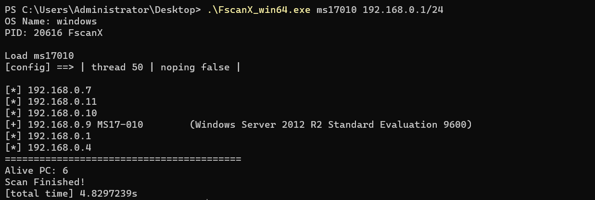
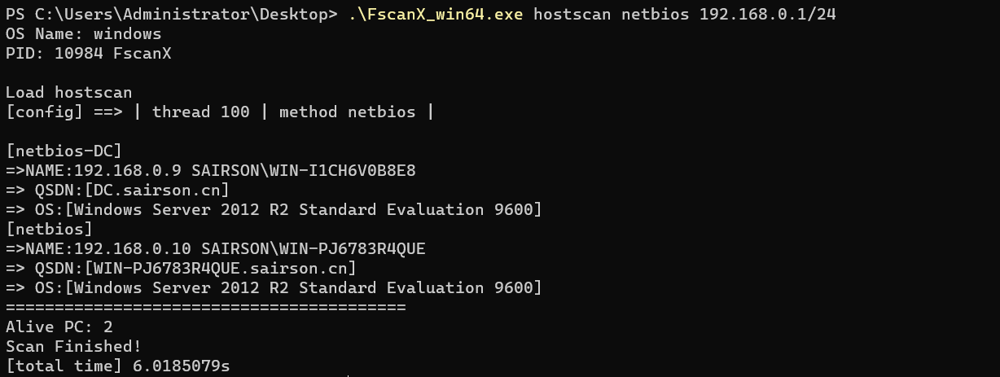

# FscanX 
其实FscanX的灵感来源于fscan和LodanGo这两个开源项目，首先不得不说fscan和LadonGo两个都是非常优秀的内网扫描器。并且其独自的特色也让其在内网扫描器领域独占鳌头。其中LadonGo的插件式让其在扫描时更加专注，而fscan的傻瓜式则让其对内网的信息搜集更加高效。
但是对于一个懒蛋的我，我选择两者都要（毕竟小孩子才做选择），所以我将其Fscan进行了完全改造，在结合了LadonGo的单插件扫描的同时，保留了Fscan对于Web的漏洞和内网服务的脆弱检测，使其即像LadonGo的同时，也更加流氓。

<br>目前实现的功能如下  （Example）:
<br>1.CVE-2020-0796 smbghost 插件扫描，支持整个C段式扫描
```shell
    FscanX.exe smbghost --thread 60 --noping 192.168.1.1/24
```

<br>2. MS-17010 Eternal blue 扫描
```shell
    FscanX.exe ms17010 192.168.1.1/24
```

<br>3. ICMP / ping 存活主机探测
```shell
    FscanX.exe hostscan icmp --thread 60 192.168.1.1/24
```

<br>4. TCP 端口扫描（支持脆弱端口的漏洞检测）
```shell
    FscanX.exe portscan --thread 60 --fragile --noping 192.168.1.1/24
```

<br>5. Web 服务检测
```shell 
    FscanX.exe webscan --thread 60 --fragile --noping 192.168.1.1/24
```

<br>6.oxid 网卡信息发现
```shell
    FscanX.exe oxidscan 192.168.1.1/24
```

<br>7.netbios 输出主机详细信息
```shell
    FscanX.exe hostscan netbios 192.168.1.1/24
```


<br> 上述为一些使用例子，详细可使用-h或--help查看帮助
<br> 视频演示：（演示系统Linux 采用upx编译FscanX_amd64）
[](https://asciinema.org/a/428622)
<br> 最后：
<br> 感谢：https://github.com/shadow1ng/fscan
<br> 感谢：https://github.com/k8gege/LadonGo

<br> 2021-8-6 更新:
<br> 修复ms17010切片长度校验
<br> 增强实战利用，增加tcp格式基于445，139，135，22端口的存活主机扫描（原因是该些端口为windows主机默认开放端口和Linux主机运维常用端口）
<br> 修改hoscan命令行格式，增加子命令，将icmp协议扫描，ping扫描，netbios扫描，tcp扫描细分，应对不同的内网环境
<br> 对netbios扫描输出格式进行处理，增加了QSDN的输出（完全主机名），来提高zerologon后续的方便使用
<br> 增加了netbios的域控识别功能
<br> 增加了默认扫描端口389，53，88端口

<br> 2021-8-5 出现问题：
<br>在使用ms17010扫描时，未对切片长度进行校验，造成了切片范围错误（目前已经完善，但未发布版本）
<br>实战中不足:走socks5代理扫描时，只有netbios能够扫描到，而icmp无法通过socks5，目前正在思考解决办法
<br>默认端口扫描问题，对于域控主机的389，88，53 未能正确扫描
<br>新问题将于下个版本解决

<br> 2021-8-3 更新：
<br> 1.修复了部分代码逻辑错误，对部分代码逻辑进行修改
<br> 2.对hostscan扫描方式做出改变，对hostscan 的--noping参数首先采用netbios的存活检测，如果netbios检测失败，则会尝试icmp协议检测而非ping命令检测
<br> 3.对portscan增加--cmd参数，用于ssh连接后执行命令
<br> 4.取消portscan的netbios参数
<br> 5.修复portscan中对于sshkey的验证问题

<br> 如有问题可以提出issue，我们共同商讨解决

